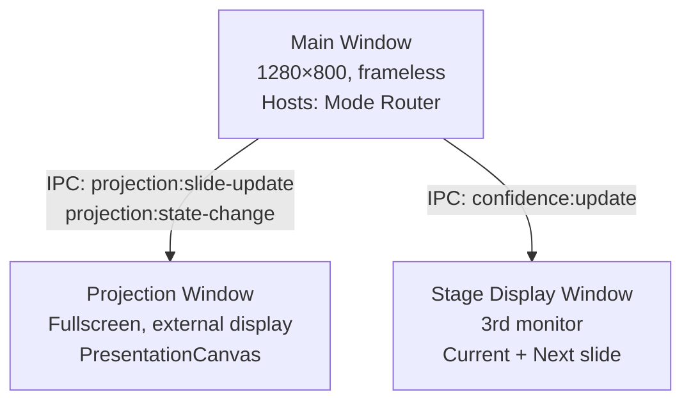

# SION Media — Enterprise Refactor System: Penjelasan Lengkap

## Ringkasan Eksekutif

Dokumen-dokumen di `10-enterprise-refactor-system/` mendefinisikan **transformasi enterprise menyeluruh** dari aplikasi SION Media — sebuah platform produksi ibadah langsung (live worship production) berbasis Electron. Total dokumentasi mencapai **~771 KB** dalam **12 dokumen utama** yang mencakup audit arsitektur, rancangan redesign, spesifikasi runtime, modernisasi UI, dan tata kelola produksi.

> [!IMPORTANT]
> **Prinsip inti:** SION Media adalah sistem produksi ibadah langsung. Kegagalan saat presentasi live berdampak langsung pada jemaat. Seluruh keputusan implementasi dievaluasi melalui lensa: _"Jika perubahan ini gagal saat ibadah berlangsung, apa yang terjadi?"_

---

## 1. Struktur Dokumen

### 1.1 Rancangan Dasar (`00-rancangan-dasar/`) — 7 Dokumen Sumber

Folder ini berisi **dokumen asli (source documents)** yang kemudian dipecah dan diorganisasi ulang ke dalam folder-folder terstruktur:

| Dokumen                                         | Ukuran | Isi                                                                                                 |
| ----------------------------------------------- | ------ | --------------------------------------------------------------------------------------------------- |
| `enterprise-redesign-system-v1.md`              | 114 KB | **Audit lengkap** — reverse-engineering seluruh arsitektur, analisis per mode, identifikasi masalah |
| `foundation-system-architecture-v1.md`          | 95 KB  | **Design system** — token warna, tipografi, spacing, animasi, komponen standar, layout              |
| `phase2-functional-refactor-architecture-v1.md` | 52 KB  | **Refactor fungsional** — dead UI, modal system, IPC normalization, state management                |
| `phase2-part2-runtime-engine.md`                | 75 KB  | **Runtime engine** — projection state machine, media engine, overlay engine, data layer             |
| `phase3-ui-modernization-system-v1.md`          | 105 KB | **UI redesign (Part 1-6)** — global UI language, title bar, Library/Projection/Management Mode      |
| `phase3-part2-ui-parts7-11.md`                  | 83 KB  | **UI redesign (Part 7-11)** — overlays, projection visual system, workflows, halaman                |
| `phase4-production-system-architecture-v1.md`   | 106 KB | **Production system** — roadmap implementasi, migrasi, tracking, testing, release                   |

### 1.2 Dokumen Governance (Root)

| Dokumen                             | Fungsi                                        |
| ----------------------------------- | --------------------------------------------- |
| `README.md`                         | Entry point sistem, aturan kritis, status     |
| `implementation-master-order-v1.md` | **"The Bible"** — urutan implementasi absolut |
| `INDEX.md`                          | Inventaris file lengkap                       |
| `document-reading-order.md`         | Urutan baca per peran/konteks                 |
| `document-dependency-map.md`        | Peta ketergantungan antar dokumen             |
| `document-migration-map.md`         | Mapping dokumen lama → baru                   |

### 1.3 Subdirektori Terstruktur

```
01-foundation/         → Audit arsitektur + design system
02-runtime-architecture/  → Refactor fungsional + runtime engine
03-ui-modernization/   → Redesign UI (Parts 1-11)
04-production-system/  → Roadmap + governance
05-migration-system/   → Panduan migrasi (diisi saat implementasi)
06-testing-system/     → Test suite (diisi saat implementasi)
07-release-system/     → Artefak release (diisi saat release)
08-governance/         → ADR + review records
09-dependency-maps/    → Grafik dependensi
archive/               → Dokumen superseded
```

---

## 2. Audit Arsitektur — Kondisi Saat Ini

### 2.1 Tech Stack

| Layer    | Teknologi                       |
| -------- | ------------------------------- |
| Runtime  | Electron 39 + Node.js           |
| UI       | React 19 + TypeScript 5.9       |
| Styling  | Tailwind CSS v4 + custom CSS    |
| State    | Zustand v5 (persist middleware) |
| Animasi  | Framer Motion v12               |
| Database | better-sqlite3 (WAL mode, FTS5) |
| IPC      | Electron contextBridge          |
| Build    | electron-vite v5                |

### 2.2 Arsitektur Window (3 Window)



### 2.3 Mode Sistem (4 Mode + Overlay)

| Mode           | Fungsi                                   | Status                       |
| -------------- | ---------------------------------------- | ---------------------------- |
| **LIBRARY**    | Browser lagu, playlist, favorit, histori | ✅ Fungsional, ada dead UI   |
| **PROJECTION** | Kontrol presentasi live, dual monitor    | ✅ Core fungsional           |
| **MANAGEMENT** | CRUD lagu, hymnal, analitik              | ✅ Fungsional, ada fake data |
| **BROADCAST**  | Streaming (future)                       | 🔴 Placeholder               |

### 2.4 State Management (9 Store)

```
useAppStore          → songs, hymnals, routing, display, toast (TERLALU LEBAR)
useModeStore         → currentMode, theme (persisted)
useProjectionStore   → slides, state machine, NEXT state (SOLID)
usePlaylistStore     → playlists, items, active (TIDAK persisted)
useAtmosphereStore   → atmosphere config, presets
useAnnouncementStore → custom slides, groups
useCacheStore        → media cache
useHealthStore       → IPC health monitoring
usePanelLayoutStore  → panel sizes (persisted)
```

---

## 3. Temuan Audit — Masalah Yang Diidentifikasi

### 3.1 Dead UI (10 Interaksi Mati)

| ID      | Masalah                                                               | Severity    |
| ------- | --------------------------------------------------------------------- | ----------- |
| DUI-001 | Tombol favorit di Library **hanya `stopPropagation()`**, tidak toggle | 🔴 Critical |
| DUI-002 | File > New Playlist **aksi kosong** `/* Will be wired */`             | 🔴 Critical |
| DUI-003 | BibleScreen **tidak bisa diakses** — tidak ada menu entry             | 🔴 Critical |
| DUI-004 | Tombol tema (Moon) **tidak melakukan apa-apa**                        | 🟡 High     |
| DUI-005 | Tombol notifikasi **tidak ada backend**                               | 🟡 High     |
| DUI-006 | Metrik storage **hardcoded "28.4 GB"** — data palsu!                  | 🔴 Critical |
| DUI-007 | Trend bars **hardcoded** `[38, 54, 42, 68, 58, 78, 86]`               | 🟡 High     |
| DUI-008 | Layout toggle button **tanpa aksi**                                   | 🟠 Medium   |
| DUI-009 | Filter button **tidak ada dropdown**                                  | 🟠 Medium   |
| DUI-010 | Tab "Chord" & "Notes" **render kosong**                               | 🟡 High     |

### 3.2 Missing Modals (20 Modal Dibutuhkan)

Yang paling kritis:

- **CreatePlaylistDialog** — tidak bisa buat playlist baru
- **DeleteConfirmDialog** — masih pakai `window.confirm()`
- **CrashRecoveryDialog** — tidak ada recovery saat crash
- **BiblePickerDialog** — tidak bisa proyeksikan ayat Alkitab

### 3.3 Runtime Gaps (8 Gap)

- Tidak ada preload pipeline untuk lagu berikutnya
- Timer tidak pernah berjalan (tidak ada interval owner)
- Confidence monitor tidak di-broadcast ke Stage Display
- Tidak ada Error Boundary per mode
- MediaEngine tanpa batas cache (pertumbuhan memori tak terbatas)

---

## 4. Rancangan Perbaikan — 12 Phase

### Overview Phase

```mermaid
graph LR
    P0["Phase 0<br/>Pre-flight<br/>Safety Infra"] --> P1["Phase 1<br/>Infrastructure<br/>Additive Only"]
    P1 --> P2["Phase 2<br/>Dead UI<br/>Fixes"]
    P2 --> P3["Phase 3<br/>Modal<br/>System"]
    P3 --> P4["Phase 4<br/>Projection<br/>Hardening"]
    P4 --> P5["Phase 5<br/>Design<br/>System"]
    P5 --> P6["Phase 6<br/>Library<br/>Mode"]
    P6 --> P7["Phase 7<br/>Projection<br/>Mode"]
    P7 --> P8["Phase 8<br/>Management<br/>Mode"]
    P8 --> P9["Phase 9<br/>Store<br/>Decomp"]
    P9 --> P10["Phase 10<br/>Stabilization"]
    P10 --> P11["Phase 11<br/>Release"]

    style P0 fill:#374151
    style P1 fill:#1e3a5f
    style P2 fill:#7f1d1d
    style P3 fill:#4c1d95
    style P4 fill:#92400e
    style P5 fill:#1e3a5f
    style P6 fill:#1e3a5f
    style P7 fill:#1e3a5f
    style P8 fill:#1e3a5f
    style P9 fill:#7f1d1d
    style P10 fill:#374151
    style P11 fill:#064e3b
```



### Detail Per Phase

#### Phase 0 — Pre-flight Safety Infrastructure

- **Tujuan:** Siapkan infrastruktur keamanan sebelum sentuh kode produksi
- **Deliverable:** Extended vitest config, test utilities, feature flag system
- **Risiko:** Tidak ada (tidak ubah kode produksi)

#### Phase 1 — Infrastructure Additions (Additive Only)

- **Tujuan:** Tambah semua sistem baru TANPA modifikasi kode existing
- **Deliverable:**
  - 3 Store baru: `useModalStore`, `useServiceStore`, `useNotificationStore`
  - 1 Hook baru: `useTimerTick`
  - 4 IPC channel baru: `system:get-storage-stats`, `db:duplicate-song`, `confidence:update`, `display:get-all`
  - 4 Migrasi DB baru: tabel service_state, song_notes, notifications, indexes
- **Risiko:** Rendah (hanya penambahan)

#### Phase 2 — Critical Dead UI Fixes

- **Tujuan:** Perbaiki 10 interaksi mati paling berdampak
- **Scope:** Wire favorite button, New Playlist, Bible access, theme button, storage metric real, timer controls
- **Risiko:** Rendah (perubahan terisolasi)

#### Phase 3 — Modal System Foundation

- **Tujuan:** Bangun infrastruktur modal terpusat, ganti semua `window.confirm()`
- **Deliverable:** Modal.tsx, ConfirmDialog, CreatePlaylistDialog, CrashRecoveryDialog, PlaylistPickerDialog, ModalRegistry
- **Risiko:** Sedang (menyentuh banyak file)

#### Phase 4 — Projection Runtime Hardening

- **Tujuan:** Perkuat runtime proyeksi dengan fitur yang hilang
- **Deliverable:** Next song preload, slide config dari settings, confidence broadcast, Error Boundary, MediaEngine LRU, auto session save
- **Risiko:** Sedang-Tinggi (menyentuh projection runtime)

#### Phase 5-8 — UI Modernization (Library, Projection, Management)

- Design system components (Button, Input, Badge, dll)
- Context menu, filter, drag-drop, virtualization
- Bible panel, announcement panel, notification panel
- Media Library section, Custom Slides section

#### Phase 9 — Store Decomposition

- **Tujuan:** Pecah `useAppStore` yang terlalu lebar menjadi focused stores
- **Strategy:** Compatibility layer → gradual migration → remove re-exports
- **Risiko:** Tinggi (menyentuh banyak komponen)

#### Phase 10-11 — Stabilization & Release

- Performance optimization, accessibility hardening
- Build validation, installer testing, release notes

---

## 5. Sistem Keamanan (Safety Systems)

### 5.1 Tiga Hukum Dasar

```
HUKUM 1: KESELAMATAN PROYEKSI
  Output live tidak boleh pernah mundur (regress).
  Jalankan 12-step validation gate sebelum merge perubahan projection-critical.

HUKUM 2: MIGRASI INKREMENTAL
  Tidak ada big-bang rewrite. Tidak ada phase yang dilewati.
  Setiap perubahan kecil, tervalidasi, dan bisa di-revert.

HUKUM 3: INFRASTRUKTUR DULU
  Sistem baru sebelum UI baru.
  Kompatibilitas sebelum migrasi.
  Fondasi sebelum fitur.
```

### 5.2 8 Aturan Kritis

1. **TIDAK PERNAH** modifikasi file projection-critical tanpa 12-step Validation Gate
2. **TIDAK PERNAH** implementasi Phase N sebelum Phase N-1 selesai
3. **TIDAK PERNAH** hapus compatibility layer sebelum semua consumer dimigrasikan
4. **TIDAK PERNAH** gunakan `window.confirm()` untuk kode baru
5. **TIDAK PERNAH** tambah cross-store reads di dalam Zustand store actions
6. **TIDAK PERNAH** rewrite file yang sudah jalan "sambil ada di situ"
7. **SELALU** jalankan `npm run typecheck + lint + test` setelah setiap perubahan
8. **SELALU** pastikan setiap perubahan bisa di-revert secara independen

### 5.3 12-Step Projection Validation Gate

```
1.  Select song → verify preview loads
2.  Space → verify LIVE state
3.  → key → verify next slide
4.  ← key → verify previous slide
5.  B → verify BLACK
6.  B again → verify returns to LIVE
7.  F → verify FREEZE
8.  F again → verify returns to LIVE
9.  Esc → verify CLEAR
10. Click different song → verify preview loads
11. Space → verify new song goes LIVE
12. Verify projection window shows correct content throughout
```

### 5.4 File Projection-Critical

File-file ini membutuhkan validation gate sebelum modifikasi:

- `useProjectionStore.ts`
- `runtimeCommandBus.ts` / `runtimeCommandHandlers.ts`
- `LivePreviewPanel.tsx` / `PresentationCanvas.tsx`
- `AtmosphereRenderer.tsx`
- `windows.ts`
- `ipc-handlers.ts` (channel proyeksi saja)

### 5.5 Feature Flag System

```typescript
FEATURE_FLAGS = {
  MODAL_SYSTEM: true, // Phase 1
  NEXT_SONG_PRELOAD: true, // Phase 4
  LIBRARY_CONTEXT_MENU: false, // Phase 6 (belum aktif)
  PROJECTION_BIBLE_PANEL: false, // Phase 7 (belum aktif)
  SONG_STORE_DECOMPOSED: false // Phase 9 (belum aktif)
}
```

---

## 6. Arsitektur Teknis Kunci

### 6.1 Design Token System (Foundation)

Sistem token lengkap mencakup:

- **Warna:** 6-level surface hierarchy, brand colors, semantic status, live/broadcast
- **Tipografi:** Poppins (heading) + Inter (UI), 12 ukuran, 6 bobot
- **Spacing:** 8pt grid system, 14 level
- **Shadow:** 5-level elevation + brand glow system
- **Animasi:** 5 easing curves, 5 durasi, Framer Motion presets
- **Z-Index:** 8 layer (base → critical)

### 6.2 Projection State Machine

```
IDLE → PREPARING → LIVE ⇄ BLACK
                   LIVE ⇄ FREEZE
                   LIVE → CLEAR
                   LIVE → LIVE_DIRTY → LIVE (updated/reverted)
```

### 6.3 Runtime Pipeline

```
Operator Input → RuntimeCommandBus (throttled, locked)
  → CommandHandler → useProjectionStore.action()
  → sendLiveSlide(data) → IPC broadcast
  → PresentationCanvas renders output
```

### 6.4 Modal Orchestration (Rancangan Baru)

```typescript
// Promise-based modal pattern
const confirmed = await openAsync<boolean>('confirm-delete', {
  title: 'Hapus lagu ini?',
  danger: true
})
if (!confirmed) return
// proceed with deletion
```

- Stack depth max 3
- Escape closes TOP modal only
- Focus trap dalam setiap modal
- No circular dependencies

---

## 7. Release Milestones

| Milestone                      | Setelah   | Konten                                        |
| ------------------------------ | --------- | --------------------------------------------- |
| **M1** Infrastructure          | Sprint 1  | Semua store, IPC, migrasi baru operasional    |
| **M2** Dead UI Eliminated      | Sprint 3  | 10 dead UI fixed, semua critical modals       |
| **M3** Runtime Hardened        | Sprint 4  | Projection hardened, stage display, auto-save |
| **M4** UI Modernized           | Sprint 8  | Ketiga mode fully modernized                  |
| **M5** Architecture Normalized | Sprint 9  | Store decomposition selesai                   |
| **M6** Production Ready        | Sprint 11 | Release v1.1.0                                |

### Critical Path untuk v1.1.0

```
Phase 0 → Phase 1 → Phase 2 → Phase 3 → Phase 4 → Phase 11
```

Phase 5-10 bisa dirilis sebagai v1.2.0 dan v1.3.0.

### v1.1.0 Blockers (9 item)

1. Favorite button wire
2. New Playlist menu
3. Bible Screen access
4. Real storage metric
5. CreatePlaylistDialog
6. DeleteConfirmDialog
7. CrashRecoveryDialog
8. Per-mode ErrorBoundary
9. ProjectionMode fallback UI

---

## 8. Status Implementasi Saat Ini

```
Phase 0  (Pre-flight):          ✅ SELESAI — 2026-05-15
Phase 1  (Infrastructure):      ✅ SELESAI — 2026-05-15
Phase 2  (Dead UI fixes):       ✅ SELESAI — 2026-05-15
Phase 3  (Modal system):        ✅ SELESAI — 2026-05-16
Phase 4  (Proj hardening):      ✅ SELESAI — 2026-05-16
Phase 5  (Design system):       ✅ SELESAI — 2026-05-16
Phase 6  (Library Mode):        ✅ SELESAI — 2026-05-15
Phase 7  (Projection Mode):     ✅ SELESAI — 2026-05-15
Phase 8  (Management Mode):     ✅ SELESAI — 2026-05-15
Phase 9  (Store decomp):        ✅ SELESAI — 2026-05-15
Phase 10 (Stabilization):       ✅ SELESAI — 2026-05-15
Phase 11 (Release):             ✅ SELESAI — 2026-05-15

Features complete: 91/91 (100%)
v1.1.0 Blockers: 0 remaining
```

> [!NOTE]
> Seluruh 91 fitur telah selesai diimplementasikan melalui 12 phase enterprise refactor.
> Lihat laporan detail di `10-implementation/` dan audit checklist di `11-audit/`.

---

## 9. Apa yang Sudah Baik (Tidak Boleh Dirusak)

Audit mengkonfirmasi beberapa sistem yang **sudah production-quality**:

| Sistem                   | Status             | Catatan                        |
| ------------------------ | ------------------ | ------------------------------ |
| `RuntimeCommandBus`      | ✅ Excellent       | Throttled, locked, validated   |
| `useProjectionStore`     | ✅ Solid           | State machine dengan LIVE_LOCK |
| `runtimeCommandHandlers` | ✅ Well-structured | Semua handler terdaftar        |
| `slideEngine.ts`         | ✅ Correct         | Cached, hash-invalidated       |
| `PresentationCanvas`     | ✅ Working         | 4 transition types             |
| `migrations.ts`          | ✅ Clean           | 13 migrasi, non-destructive    |
| `ipc-health.ts`          | ✅ Working         | Heartbeat system               |
| `usePanelLayoutStore`    | ✅ Persisted       | Correctly saved                |

> [!CAUTION]
> Sistem-sistem di atas **tidak boleh dimodifikasi** kecuali secara additive, dan hanya setelah Phase 4. Mereka adalah jantung dari aplikasi live production.
